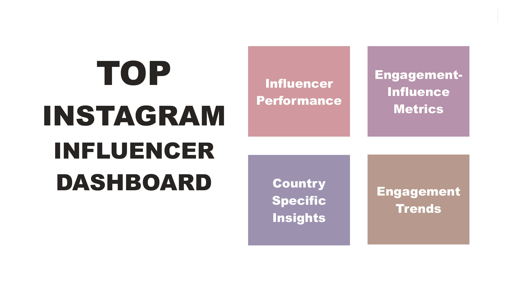

# 📊 Top Instagram Influencers Dashboard
“Internship project analyzing Instagram influencer data with a cleaned dataset and a Power BI dashboard for engagement and geographic trends.”

## 🔍 Overview
This Business Analytics internship project explores top Instagram influencers using cleaned data to generate visual insights in Power BI. The dashboard highlights:
- Follower metrics
- Engagement rates
- Geographic trends
- Country-wise influence distribution

## 🛠 Tools Used
- Microsoft Excel (Data Cleaning)
- Power BI (Dashboard)
- PDF & PNG (Exported visuals)

## 📁 Project Structure
top-instagram-influencers-dashboard/
│
├── data/
│ └── top_insta_influencers_data_cleaned.xlsx
│
├── dashboard/
│ └── influencers_dashboard.pbix ← For interactive exploration
│ └── Dashboard_2.pdf ← For quick preview
| └── dashboard_preview.png  ← For README display

> Download the `.pbix` file to explore the Power BI dashboard interactively, or preview the PDF for a quick summary.

## 📈 Key Insights
- **Top Influencers**: Cristiano Ronaldo, Selena Gomez, Kylie Jenner.
- **Highest Follower Countries**: USA, Brazil, India.
- **Lowest Engagement**: Despite high followers, some accounts showed < 0.01% engagement.
- **Like-to-Follower Ratio** varies dramatically by geography.

## 📊 Dashboard Preview

## 📚 Data
- Source: Provided during internship (confidential dataset cleaned for public insight).
- File: `top_insta_influencers_data_cleaned.xlsx` in `/data/`

## 📌 How to Use
- Clone this repo
- Open the Power BI dashboard (`influencers_dashboard.pbix`) from the `/dashboard/` folder to interactively explore the data.
- Alternatively, view the PDF (`Dashboard_2.pdf`) for a quick visual summary.
- Explore the visual trends and filters

## 🧑‍💻 Author
- **Name**: Hrutuja Gawande
- **Role**: Business Analytics Intern, Unified Mentors

## 🚧 Project Status
✅ Completed

## 📄 License
This project is for educational purposes only. Not for commercial use.
